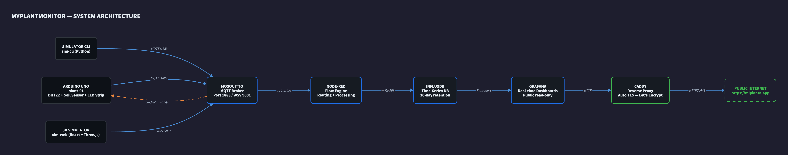

# myplantmonitor

Sistema completo de monitoreo de plantas con IoT: Arduino UNO (o simulador) → MQTT → Node-RED → InfluxDB → Grafana, con Caddy como proxy reverso y TLS automático. Desplegado en una instancia ARM EC2.

Proyecto escolar de **Abby Sierra Cubillos** (grado 11, Gimnasio Fontana, Bogotá).
Construido con base en investigación sobre IoT, MQTT e infraestructura en la nube.

*[Read in English](README.md)*

## Demo en vivo

- **Dashboard de Grafana** (datos de sensores en tiempo real): [https://miplanta.app/](https://miplanta.app/)
- **Simulador 3D** (control interactivo de la planta): [https://miplanta.app/sim/](https://miplanta.app/sim/)

## Arquitectura



## URLs (post-despliegue)

| URL                            | Descripción                    |
| ------------------------------ | ------------------------------ |
| `https://${DOMAIN}/`           | Dashboards de Grafana          |
| `https://${DOMAIN}/sim`        | Simulador 3D web               |
| `https://${DOMAIN}/nodered`    | Editor Node-RED (con auth)     |
| `wss://${DOMAIN}/mqtt`         | MQTT sobre WebSocket           |
| `mqtt://${DOMAIN}:1883`        | MQTT (TCP plano)               |

## Contrato de temas MQTT

| Tema (Topic)                  | Dirección           | Payload                                          |
| ----------------------------- | ------------------- | ------------------------------------------------ |
| `sensors/<device_id>/state`   | sensor → broker     | `{temperature, humidity, soil_moisture, ts}`      |
| `cmd/<device_id>/light`       | dashboard → device  | `{on: bool}`                                     |
| `state/<device_id>/light`     | device → broker     | `{on: bool}`                                     |

IDs de dispositivos: `plant-01` (Arduino UNO), `sim-cli` (Python), `sim-web` (navegador).

## Despliegue

1. **Dominio**: `miplanta.app` (registrado en name.com).
2. **Provisionar infra**: `cd infra && cp terraform.tfvars.example terraform.tfvars && make tf-init && make tf-apply`.
   Apuntar un registro A al EIP de los outputs.
3. **Configurar secretos**: `cp .env.example .env` y llenar con valores reales.
4. **Desplegar el stack**: `make deploy` — sincroniza al EC2 y ejecuta `docker compose up -d`.
5. **Primera vez en el servidor**: `make ssm`, luego en el EC2: `bash mosquitto/setup.sh` y `docker compose restart mosquitto`.

## Desarrollo local

- `make sim-cli` — simulador de sensores en Python.
- `make sim-web-dev` — simulador 3D con Vite hot reload.
- `make demo` — simulador apuntando al broker de producción.

## Estructura del repositorio

```
infra/            Terraform — EC2, SG, IAM, EIP
stack/            Docker Compose: Mosquitto, Node-RED, InfluxDB, Grafana, Caddy
simulator-cli/    Simulador headless con Python paho-mqtt
simulator-web/    Simulador 3D con Vite + React + react-three-fiber
firmware/         Arduino C/C++ para Arduino UNO (plant-01)
docs/             Diagramas de arquitectura y documentación
```

## Documentación

- [`docs/architecture.md`](docs/architecture.md) — arquitectura técnica completa
- [`docs/demo-script.md`](docs/demo-script.md) — guión de presentación

## Licencia

[MIT](LICENSE) — Copyright (c) 2026 Abby Sierra Cubillos
